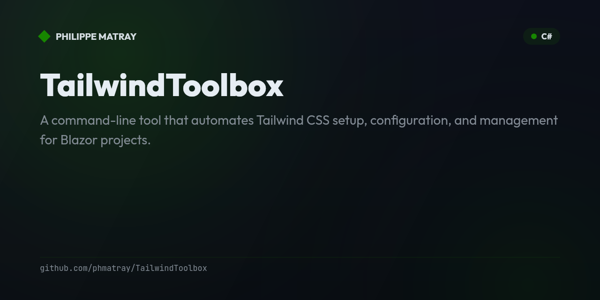

# Tailwind Blazor CLI

<!-- portfolio-toc:start -->

## Table of Contents

- [Features](#features)
- [Quick Start](#quick-start)
- [Commands](#commands)
- [Project Structure After Setup](#project-structure-after-setup)
- [Validation Categories](#validation-categories)
- [Troubleshooting](#troubleshooting)
- [Development](#development)
- [Technology Stack](#technology-stack)
- [Contributing](#contributing)
- [License](#license)
- [Support](#support)
- [Acknowledgments](#acknowledgments)

<!-- portfolio-toc:end -->


A command-line tool that automates Tailwind CSS setup, configuration, and management for Blazor projects.

[](https://dotnet.microsoft.com/)
[](https://tailwindcss.com/)
[](LICENSE)

## Features

- ✅ **One-Command Setup** - Initialize Tailwind CSS in any Blazor project with a single command
- ✅ **Automatic Validation** - Validate configuration files, dependencies, and build integration instantly
- ✅ **Safe Updates** - Update Tailwind packages with breaking change detection and migration guidance
- ✅ **MSBuild Integration** - Automatic MSBuild target generation for seamless compilation
- ✅ **Cross-Platform** - Works on Windows, macOS, and Linux
- ✅ **Multi-Project Support** - Supports Blazor Server, WebAssembly, and Hybrid projects

## Quick Start

### Prerequisites

- **.NET 6.0 or higher** ([Download](https://dotnet.microsoft.com/download))
- **Node.js 16+ and npm** ([Download](https://nodejs.org/))
- **A Blazor project** (existing or new)

### Installation

#### macOS/Linux

```bash
# Clone the repository
git clone https://github.com/yourusername/TailwindToolbox.git
cd TailwindToolbox

# Run installation script
./scripts/install-tool.sh

# Verify installation
tailwind-blazor --version
```

#### Windows

```powershell
# Clone the repository
git clone https://github.com/yourusername/TailwindToolbox.git
cd TailwindToolbox

# Build the project
dotnet build -c Release TailwindToolbox/TailwindToolbox.csproj

# Add to PATH or copy to a directory in your PATH
```

#### Build from Source

```bash
dotnet build -c Release TailwindToolbox/TailwindToolbox.csproj
```

### Setup Tailwind in Your Blazor Project

Navigate to your Blazor project directory and run:

```bash
cd /path/to/your/BlazorProject
tailwind-blazor setup
```

**What happens:**
- Detects your Blazor project type (Server/WebAssembly/Hybrid)
- Installs Tailwind CSS npm packages
- Creates `tailwind.config.js` with `.razor` file content paths
- Creates `package.json` with Tailwind build scripts
- Creates `Styles/app.css` with Tailwind directives
- Generates `TailwindBuild.targets` for MSBuild integration
- Updates `.gitignore` to exclude `node_modules`

Build and run your project:

```bash
dotnet build
dotnet run
```

Add Tailwind classes to your components:

```razor
<div class="container mx-auto p-4">
    <h1 class="text-3xl font-bold text-blue-600">
        Hello, Tailwind!
    </h1>
</div>
```

## Commands

### `setup`

Initialize Tailwind CSS configuration in a Blazor project.

```bash
tailwind-blazor setup [options]
```

**Options:**
- `--project-dir <path>` - Blazor project directory (default: current directory)
- `--tailwind-version <version>` - Specific Tailwind CSS version to install
- `--force` - Overwrite existing configuration files without prompting
- `--dry-run` - Preview changes without writing files
- `--skip-npm-install` - Skip npm package installation
- `--css-output <path>` - Custom CSS output path

**Examples:**
```bash
tailwind-blazor setup
tailwind-blazor setup --project-dir ./MyBlazorApp
tailwind-blazor setup --force
tailwind-blazor setup --dry-run
```

### `check`

Validate Tailwind CSS configuration and dependencies.

```bash
tailwind-blazor check [options]
```

**Options:**
- `--project-dir <path>` - Blazor project directory (default: current directory)
- `--category <category>` - Filter by category: environment, files, config, dependencies, integration
- `--format <format>` - Output format: table (default), json, text
- `--fail-on-warning` - Treat warnings as errors (exit code 1)

**Examples:**
```bash
tailwind-blazor check
tailwind-blazor check --format json
tailwind-blazor check --category dependencies
tailwind-blazor check --fail-on-warning
```

**Exit Codes:**
- `0` - All checks passed or warnings only
- `1` - One or more errors detected
- `2` - Project not found

### `update`

Update Tailwind CSS and related packages with breaking change detection.

```bash
tailwind-blazor update [options]
```

**Options:**
- `--project-dir <path>` - Blazor project directory (default: current directory)
- `--package <name>` - Specific package to update (default: all Tailwind packages)
- `--target-version <version>` - Target version for update
- `--dry-run` - Preview updates without applying them
- `--skip-breaking` - Skip major version updates automatically

**Examples:**
```bash
tailwind-blazor update
tailwind-blazor update --dry-run
tailwind-blazor update --skip-breaking
tailwind-blazor update --package tailwindcss --target-version 4.0.5
```

**Exit Codes:**
- `0` - Updates applied successfully
- `1` - Update failed
- `2` - User cancelled breaking change update
- `3` - No updates available

### `create-target`

Create or update MSBuild .targets file for Tailwind CSS compilation.

```bash
tailwind-blazor create-target [options]
```

**Options:**
- `--project-dir <path>` - Blazor project directory (default: current directory)
- `--target-name <name>` - MSBuild target name (default: BuildTailwindCSS)
- `--input-css <path>` - Input CSS file path (default: Styles/app.css)
- `--output-css <path>` - Output CSS file path (default: wwwroot/css/app.css)
- `--minify <mode>` - Minify mode: always, never, release-only (default)
- `--force` - Overwrite existing .targets file without prompting
- `--dry-run` - Preview generated XML without writing

**Examples:**
```bash
tailwind-blazor create-target
tailwind-blazor create-target --force
tailwind-blazor create-target --input-css Styles/main.css --output-css wwwroot/css/main.css
```

## Project Structure After Setup

```
MyBlazorApp/
├── MyBlazorApp.csproj              # Updated with MSBuild import
├── tailwind.config.js              # Tailwind configuration
├── package.json                    # npm dependencies
├── package-lock.json               # npm lock file (generated)
├── node_modules/                   # npm packages (gitignored)
├── TailwindBuild.targets           # MSBuild integration
├── Styles/
│   └── app.css                     # Tailwind input CSS
└── wwwroot/
    └── css/
        └── app.css                 # Compiled Tailwind CSS (generated)
```

## Validation Categories

The `check` command validates 17 rules across 5 categories:

### Environment (3 rules)
- Node.js installation check
- npm installation check
- .NET version compatibility

### Files (5 rules)
- `tailwind.config.js` exists
- `package.json` exists
- Input CSS file exists
- MSBuild .targets file exists
- `.gitignore` configured for `node_modules`

### Configuration (4 rules)
- Tailwind config is valid JavaScript
- `package.json` is valid JSON
- Content paths include `.razor` files
- Build scripts present in `package.json`

### Dependencies (3 rules)
- Tailwind CSS version check
- Autoprefixer version check
- No deprecated packages

### Integration (2 rules)
- MSBuild import exists in `.csproj`
- .targets XML is valid

## Troubleshooting

### Node.js not found

**Error:** `Node.js is not installed or not in PATH`

**Solution:**
1. Install Node.js from [nodejs.org](https://nodejs.org/)
2. Or use nvm: `nvm install --lts`
3. Restart your terminal
4. Run `tailwind-blazor setup` again

### Not a Blazor project

**Error:** `Not a Blazor project`

**Solution:**
1. Ensure you're in the correct directory: `cd /path/to/BlazorProject`
2. Or specify project directory: `tailwind-blazor setup --project-dir /path/to/BlazorProject`

### npm install fails

**Error:** Network errors during npm package installation

**Solution:**
1. Check internet connection
2. Retry setup (it's idempotent): `tailwind-blazor setup`
3. Or manually install: `npm install tailwindcss autoprefixer`

### Tailwind styles not applied

**Issue:** Styles don't appear in the browser

**Solution:**
1. Verify CSS reference in layout file:
   ```razor
   <link href="css/app.css" rel="stylesheet" />
   ```
2. Rebuild project:
   ```bash
   dotnet clean
   dotnet build
   ```
3. Run validation:
   ```bash
   tailwind-blazor check
   ```

## Development

### Building from Source

```bash
# Restore dependencies
dotnet restore

# Build project
dotnet build TailwindToolbox/TailwindToolbox.csproj

# Run tests
dotnet test TailwindToolbox.Tests/TailwindToolbox.Tests.csproj
```

### Running Tests

```bash
# Run all tests
dotnet test

# Run with detailed output
dotnet test --verbosity detailed

# Run specific test category
dotnet test --filter Category=Unit
dotnet test --filter Category=Integration
dotnet test --filter Category=Contract
```

### Project Structure

```
TailwindToolbox/
├── TailwindToolbox/              # Main CLI project
│   ├── Commands/                 # CLI command implementations
│   ├── Services/                 # Business logic services
│   ├── Models/                   # Data models
│   └── Templates/                # Embedded configuration templates
├── TailwindToolbox.Tests/        # Test project
│   ├── Unit/                     # Unit tests
│   ├── Integration/              # Integration tests
│   └── Contract/                 # Contract tests
├── scripts/                      # Installation scripts
└── specs/                        # Feature specifications
```

## Technology Stack

| Component | Technology | Version |
|-----------|-----------|---------|
| Language | C# | 12 (.NET 10) |
| CLI Framework | Spectre.Console.Cli | Latest |
| Testing | xUnit | v3 |
| Target CSS Framework | Tailwind CSS | v4.x |
| Build Integration | MSBuild Targets | .NET 10 SDK |

<!-- portfolio-roadmap:start -->

## Roadmap

Planned work and known limitations are tracked in the [open issues](https://github.com/phmatray/TailwindToolbox/issues). Contributions toward them are welcome.

<!-- portfolio-roadmap:end -->

## Contributing

See [CONTRIBUTING.md](CONTRIBUTING.md) for development setup, testing guide, and pull request process.

## License

This project is licensed under the MIT License - see the [LICENSE](LICENSE) file for details.

## Support

- **Documentation:** See [quickstart guide](specs/001-tailwind-blazor-cli/quickstart.md) for detailed usage
- **Issues:** Report bugs at [GitHub Issues](https://github.com/yourusername/TailwindToolbox/issues)
- **Help:** Run `tailwind-blazor --help` for command reference

## Acknowledgments

- Built with [Spectre.Console](https://spectreconsole.net/) for beautiful CLI output
- Powered by [Tailwind CSS](https://tailwindcss.com/) for utility-first styling
- Designed for [Blazor](https://dotnet.microsoft.com/apps/aspnet/web-apps/blazor) web development
