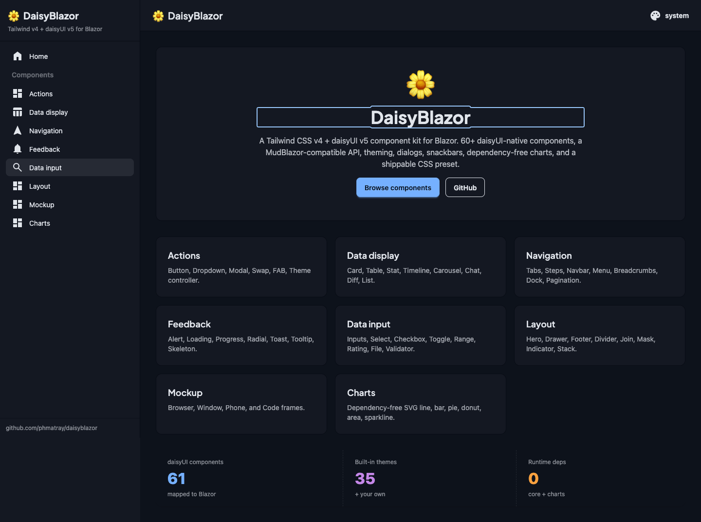
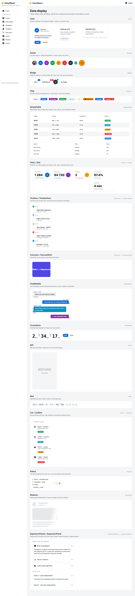
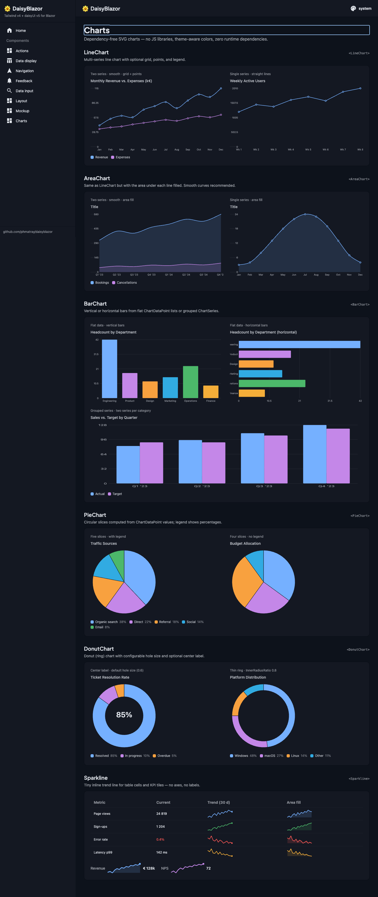
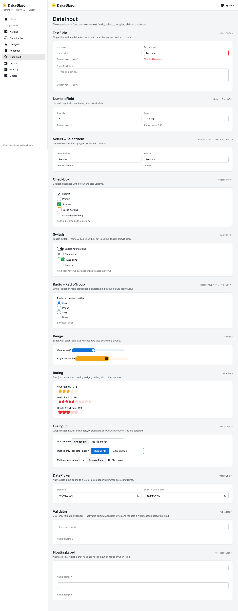

<h1 align="center">🌼 DaisyBlazor</h1>

<p align="center">
  <strong>A Tailwind CSS v4 + daisyUI v5 component library for Blazor.</strong><br/>
  60+ daisyUI-native components, a MudBlazor-compatible API, theming, dialogs, snackbars,
  dependency-free charts, a shippable CSS preset, and a <code>dotnet new</code> template.
</p>

<p align="center">
  <a href="https://www.nuget.org/packages/DaisyBlazor.Components"></a>
  <a href="https://www.nuget.org/packages/DaisyBlazor.Components"></a>
  <a href="https://github.com/phmatray/daisyblazor/actions/workflows/ci.yml"></a>
  <a href="LICENSE"></a>
  
</p>

<p align="center">
  <a href="https://phmatray.github.io/daisyblazor/"><strong>📖 Documentation</strong></a> ·
  <a href="https://phmatray.github.io/daisyblazor/getting-started/">Getting started</a> ·
  <a href="https://www.nuget.org/profiles/phmatray">NuGet</a>
</p>

<p align="center">
  
</p>

---

## The problem it solves

Blazor has no first-class Tailwind/daisyUI component story. Today you usually pick one of two paths,
and both have real costs:

- **Adopt a heavyweight component framework** (MudBlazor, Radzen, …) — you inherit its design language,
  its CSS runtime, and its lock-in. Restyling to match a Tailwind/daisyUI design system fights the framework.
- **Hand-roll daisyUI markup** — you write `<button class="btn btn-primary">` everywhere, then re-implement
  theming, dialogs, toasts, form binding, and a Tailwind build by hand in every project.

**DaisyBlazor closes that gap:**

| Pain | DaisyBlazor |
|------|-------------|
| No native daisyUI components for Blazor | **60+ components** mapped to daisyUI's own taxonomy (Actions, Data display, Navigation, Feedback, Data input, Layout, Mockup). |
| Migrating off MudBlazor is all-or-nothing | A **MudBlazor-compatible API** (`Button`, `Card`, `Table`, `IDialogService`, `ISnackbar`, `Icons.Material.*`) — migrate incrementally by renaming `MudX` → `X`. |
| Wiring Tailwind + daisyUI + a class safelist is fiddly | A **shippable CSS preset** — one `@import` enables daisyUI, the themes, and the dynamic-class safelist. |
| Theming/dark-mode is manual | A parameter-driven **`ThemeProvider`** with **35 built-in themes** + your own, dark mode, and SSR-safe persistence. |
| Charts mean a heavy JS dependency | **Dependency-free SVG charts** that follow the active daisyUI theme — zero charting runtime. |
| Starting a new app is boilerplate | `dotnet new daisyblazor` scaffolds a wired app in seconds. |

## Quick start

Scaffold a new app:

```bash
dotnet new install DaisyBlazor.Templates
dotnet new daisyblazor -o MyApp
cd MyApp && npm install && dotnet run
```

…or add it to an existing Blazor app:

```bash
dotnet add package DaisyBlazor.Components
npm install -D tailwindcss @tailwindcss/cli daisyui
```

```csharp
// Program.cs
builder.Services.AddDaisyBlazor();
```

```css
/* Styles/main.css — Tailwind v4 source globs are one line per extension (no { } brace groups). */
@import "tailwindcss";
@import "daisyblazor/preset.css";
@source "../**/DaisyBlazor.Components/**/*.razor";
@source "../**/DaisyBlazor.Components/**/*.cs";
```

```razor
<Card>
    <CardContent>
        <h2 class="card-title">Hello DaisyBlazor</h2>
        <Tabs>
            <Tab Title="One">First panel</Tab>
            <Tab Title="Two">Second panel</Tab>
        </Tabs>
        <Button Color="Color.Primary" StartIcon="@Icons.Material.Filled.Check">OK</Button>
    </CardContent>
</Card>
```

Full setup (CSS pipeline, fonts, DI, theming) is in **[Getting started](https://phmatray.github.io/daisyblazor/getting-started/)**.

## Packages

| Package | Version | Description |
|---|---|---|
| **DaisyBlazor.Components** | [](https://www.nuget.org/packages/DaisyBlazor.Components) | The component kit: daisyUI-native components + MudBlazor-compatible surface, `ThemeProvider`, dialog/snackbar services, and the CSS preset. |
| **DaisyBlazor.Charts** | [](https://www.nuget.org/packages/DaisyBlazor.Charts) | Dependency-free SVG charts (line, area, bar, pie/donut, sparkline) themed by daisyUI. |
| **DaisyBlazor.Templates** | [](https://www.nuget.org/packages/DaisyBlazor.Templates) | `dotnet new daisyblazor` starter template. |
| **@daisyblazor/tailwind** | — | npm package shipping the Tailwind/daisyUI preset for non-.NET build pipelines. |

## Screenshots

<table>
  <tr>
    <td width="50%"><br/><sub><b>Data display</b> — cards, table, stats, timeline, chat, carousel…</sub></td>
    <td width="50%"><br/><sub><b>Charts</b> — dependency-free SVG, theme-aware</sub></td>
  </tr>
  <tr>
    <td width="50%"><br/><sub><b>Data input</b> — inputs, select, range, rating, validation…</sub></td>
    <td width="50%"><br/><sub><b>Theming</b> — 35 daisyUI themes, light & dark</sub></td>
  </tr>
</table>

Run the live gallery yourself: `dotnet run --project samples/DaisyBlazor.Gallery`.

## Repo layout

```
src/        DaisyBlazor.Components, DaisyBlazor.Charts, DaisyBlazor.Tailwind
samples/    DaisyBlazor.Gallery — a runnable showcase of every component
templates/  DaisyBlazor.Templates — dotnet new template
website/    Astro Starlight documentation site (GitHub Pages)
tests/      bUnit component tests
docs/       markdown source for the docs site
scripts/    update-deps, build-css, pack
```

## Documentation

📖 **<https://phmatray.github.io/daisyblazor/>**

- [Getting started](https://phmatray.github.io/daisyblazor/getting-started/) — install, CSS wiring, DI, fonts.
- [Theming](https://phmatray.github.io/daisyblazor/theming/) — `ThemeProvider`, built-in & custom themes.
- [CSS preset](https://phmatray.github.io/daisyblazor/css-preset/) — what `preset.css` ships and how to wire `@source`.
- [Component reference](https://phmatray.github.io/daisyblazor/components/) — every component by daisyUI category.
- [Charts](https://phmatray.github.io/daisyblazor/charts/) — the dependency-free SVG charts.
- [Migrating from MudBlazor](https://phmatray.github.io/daisyblazor/migration/) — the `MudX` → `X` map.

<!-- portfolio-techstack:start -->

## Tech Stack

- **.NET 10**
- DaisyBlazor.Components
- DaisyBlazor.Charts
- bunit
- Shouldly
- xunit.v3
- xunit.runner.visualstudio

<!-- portfolio-techstack:end -->

## Contributing & releasing

See [CONTRIBUTING.md](CONTRIBUTING.md) for the branch strategy (`main` / `release` / feature branches)
and the automated release pipeline.

## License

[MIT](LICENSE)
